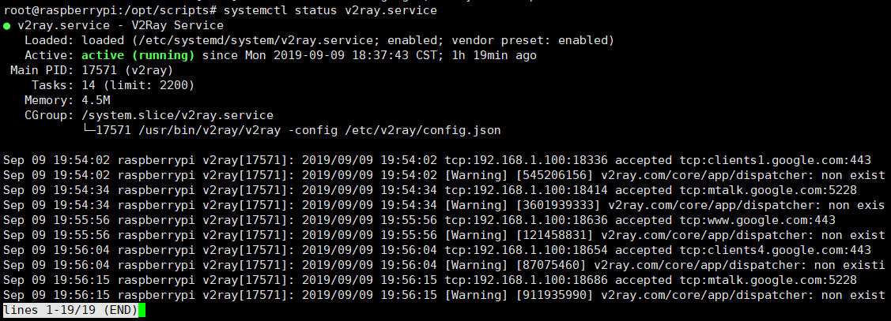
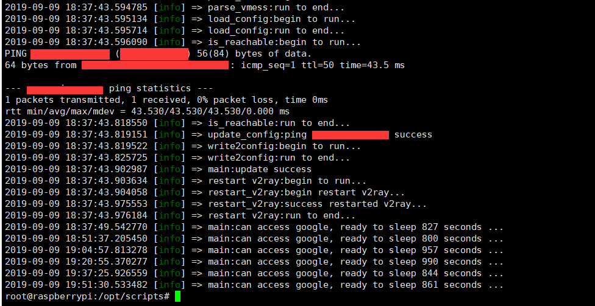
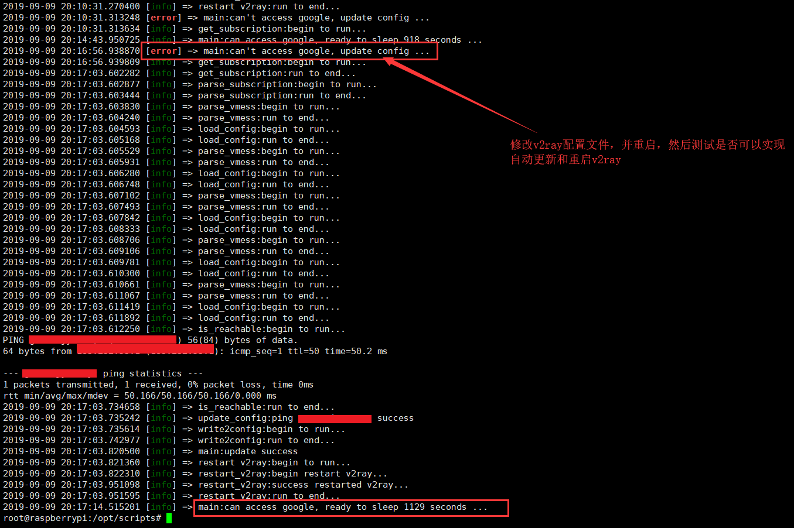
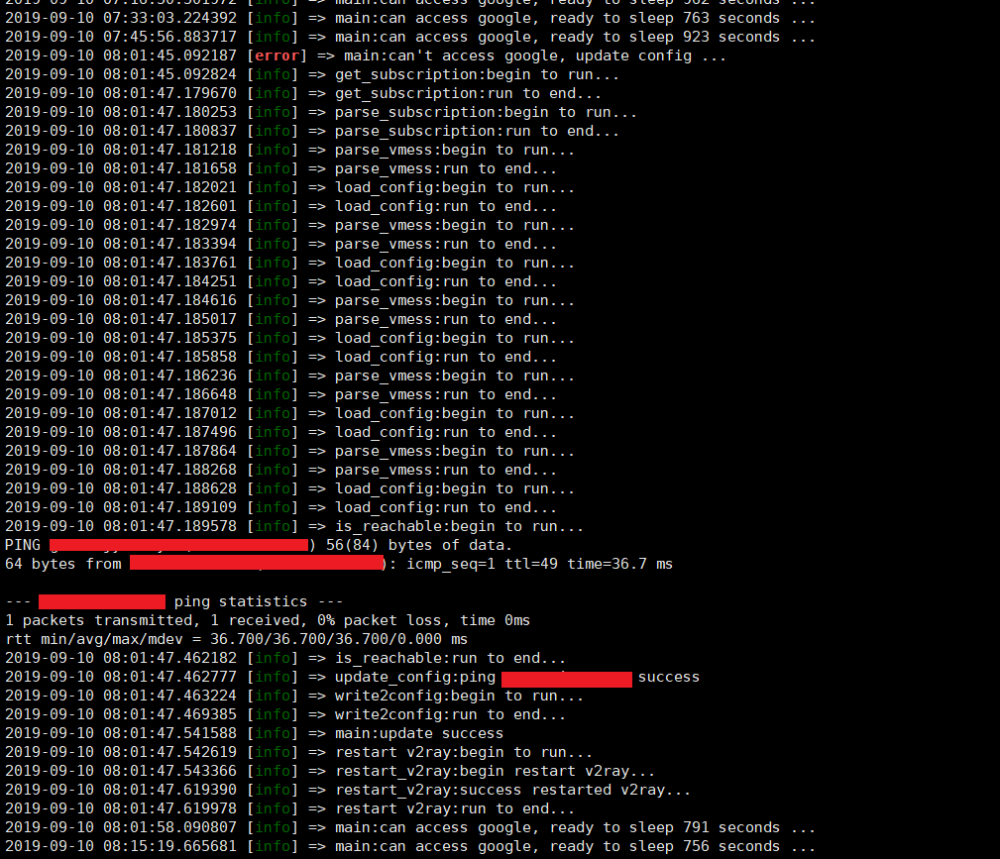

# auto-update-v2ray-conf

> 自动监控v2ray节点是否可以正常使用，节点失效请求订阅服务器最新的节点数据然后进行更新配置文件重启v2ray

## 项目结构说明

* `auto-update-v2ray-conf`：项目名
  * `config`：存储本人使用的`v2ray`的配置文件，建议使用该文件
  * `picture`：`README`使用到的图片
  * `scripts.py`：最新稳定的脚本
  * `scripts_x.x.py`：历史版本。。。

## 项目说明

> 由于自己树莓派搭建了一个v2ray的客户端，然后通过NAT让树莓派通过socks5代理为实验室局域网所有的电脑提供代理，但是由于本人要去实习，没办法去更改和及时维护失效节点，所以写了这个脚本。因为实验室中的其他同学不懂这些，自己也学以致用。代码有居多`bad smell`食用谨慎，避免中毒。预先说明，我是用Python写的 “C语言”。由于我的订阅服务器是`base64`编码的方式，其他的同学根据自己的方式修改下。

## 关于脚本中使用的sleep

> 由于该脚本对定时信息不敏感，所以为了实现快速方便起见，直接使用sleep(这样太残暴了)，因为这个时间多一些少一些都是可以的。如果某些朋友需要定时更加准确地请使用其他的方式（Timer、schedule …）。

## 如何保证脚本一直在执行

> 我有点杀鸡用牛刀了，我是用的是`supervisor`，其实可以直接使用`crontab`来进行定时任务。使用`supervisor`本身而言，可以监控脚本的信息并进行重启等操作，相对来说好一些，但是一个简单的脚本是不必要的。

## 脚本配置简单说明

* `uri`：服务器的订阅地址
* `config_path`：v2ray的配置文件地址
* `scripts_log`：脚本打印的日志

## 日志说明

> 我对日志只是两个级别一个是`info`，另一个是`error`，因为我觉得这个就够了。日志打印较为随意。

## 执行测试

> 修改v2ray配置文件使节点无效，然后将v2ray重启，测试脚本是否可以检测到该问题并重新拉取节点信息，重新生成配置信息并重启v2ray。

## 夜间日志记录

> 该图是我早上到实验室查看日志发现的，说明脚本执行正常。

